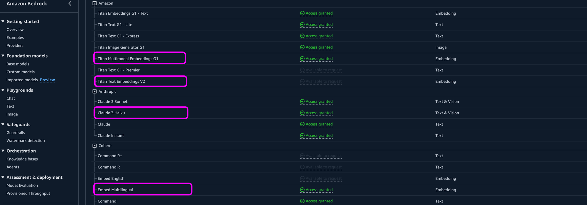

# Amazon OpenSearch Service와 Amazon Bedrock과 함께 하는 검색의 진화
"Amazon OpenSearch Service와 Amazon Bedrock와 함께하는 검색의 진화" 워크샵에 오신 것을 환영합니다. 이 워크샵은 Amazon OpenSearch Service와 Amazon Bedrock을 활용하여 다양한 검색 기법을 구현하는 것을 목표로 설계되었습니다.

이 워크샵에서 구현해볼 시스템의 아키텍처는 다음과 같습니다.

이 워크샵에서 사용하는 서비스와 기술은 다음과 같습니다. 

- Amazon OpenSearch Services
- Amazon Bedrock - Cohere 다국어 임베딩 모델
- Amazon Bedrock - Claude 3 언어 생성 모델
- LangChain

본 세션을 완료한 후에는 다음을 수행할 수 있습니다.

1. BM25 알고리즘을 활용한 기존 방식의 키워드 검색 (Lexical Search)
2. 임베딩 모델로 벡터화된 데이터의 유사도를 통한 시맨틱 검색 (Semantic Search)
3. 키워드 검색과 시맨틱 검색을 적절하게 조합한 하이브리드 검색 (Hybrid Search)
4. 생성형 AI와 융합하여 사람에게 질문하듯이 검색하는 대화형 검색 (Conversational Search)