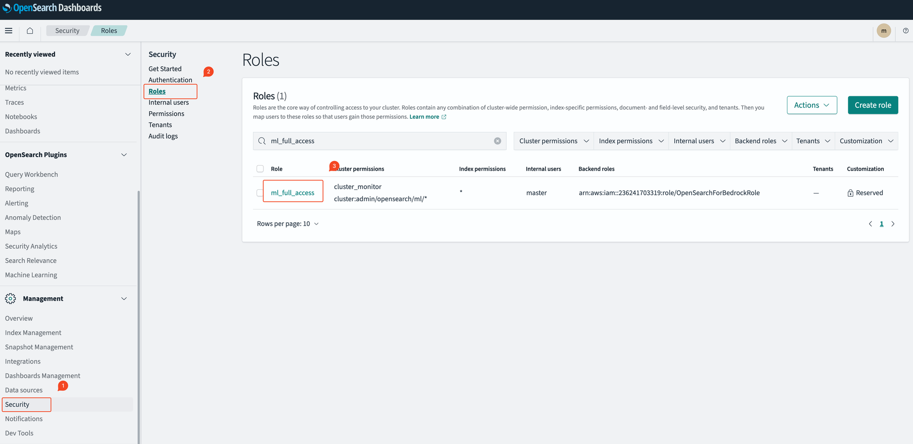
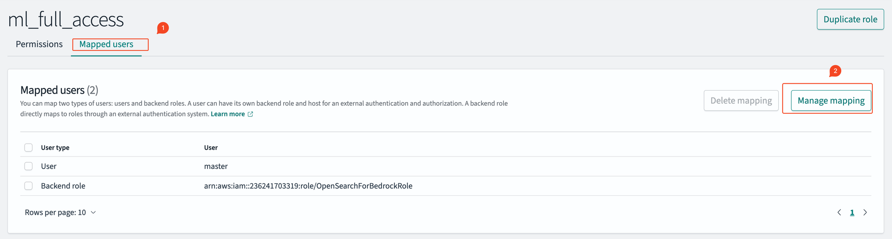
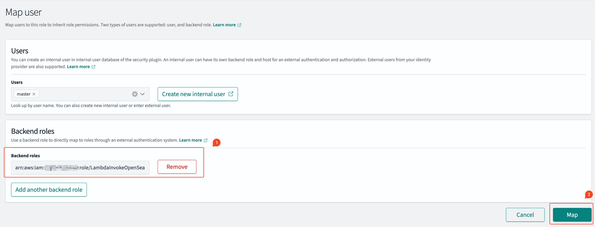
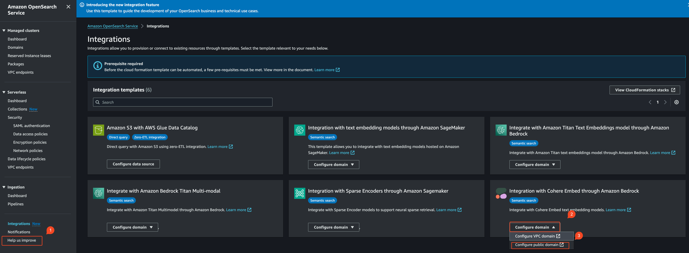
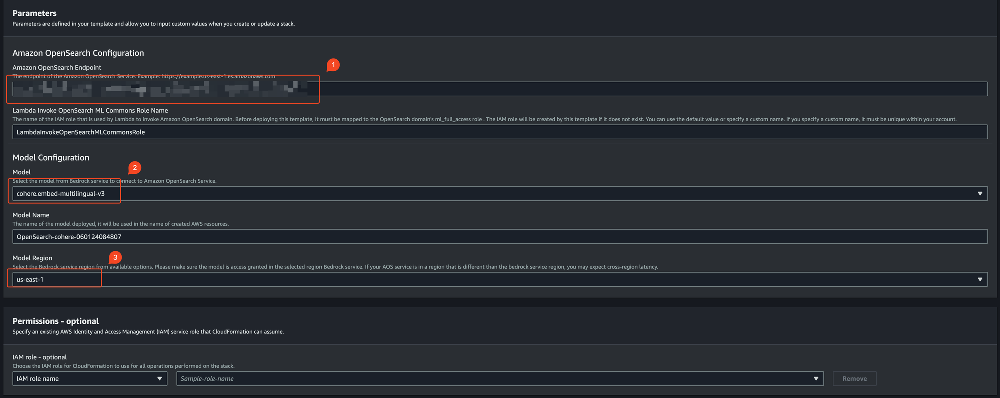
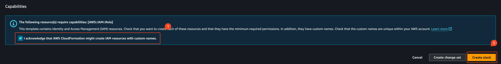
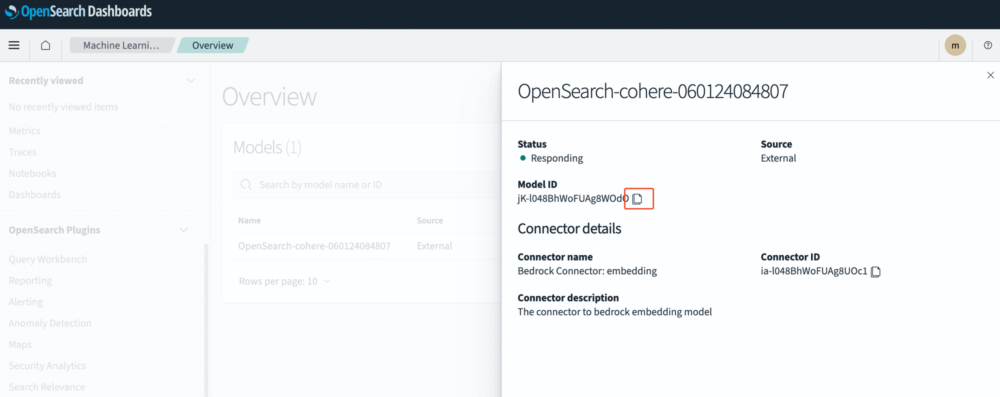

# Integration 메뉴를 활용한 손쉬운 배포

## IAM 권한 설정

CloudFormation 템플릿은 `LambdaInvokeOpenSearchMLCommonsRole`이라는 기본 이름으로 Lambda IAM 역할을 생성합니다. 다른 이름을 선택하려면 이 이름을 변경할 수 있습니다. 템플릿이 이 IAM 역할을 생성한 후, Lambda 함수가 OpenSearch Service 도메인을 호출할 수 있도록 권한을 부여해야 합니다. 이 작업을 위해, 다음 단계에 따라 `ml_full_access`라는 역할을 OpenSearch Service 백엔드 역할에 매핑하십시오.

- Amazon OpenSearch Dashboard 왼쪽의 Security 메뉴를 선택
- Roles 메뉴를 선택
- `ml_full_access`를 검색한 후 클릭



- Mapped users 탭을 선택
- Managed mapping 버튼 클릭



- 다음과 같은 형식을 Backend Role에 추가

```python
arn:aws:iam::<account-id>:role/LambdaInvokeOpenSearchMLCommonsRole
```



## Amazon Bedrock 커넥터 CloudFormation Template 배포

- Amazon OpenSearch Service Console 화면에서 Integration을 선택
- Integration with Cohere Embed through Amazon Bedrock 에서 Configure domain을 선택하고, configure public domain을 선택



- Amazon OpenSearch Endpoint를 입력
- 모델을 cohere.embed-multilingual-v3 선택
- OpenSearch Domain과 같은 리전을 선택



- 확인을 클릭하고 Create stack 버튼 클릭



## Amazon Bedrock Cohere 모델 배포 확인

- Amazon OpenSearch Dashboard 메뉴에서 Machine Learning을 선택하고 모델을 확인
- 모델의 아이디를 확인하기 위해 Action 버튼을 클릭


- Model ID 를 복사해 기록



## 배포 성공!!!