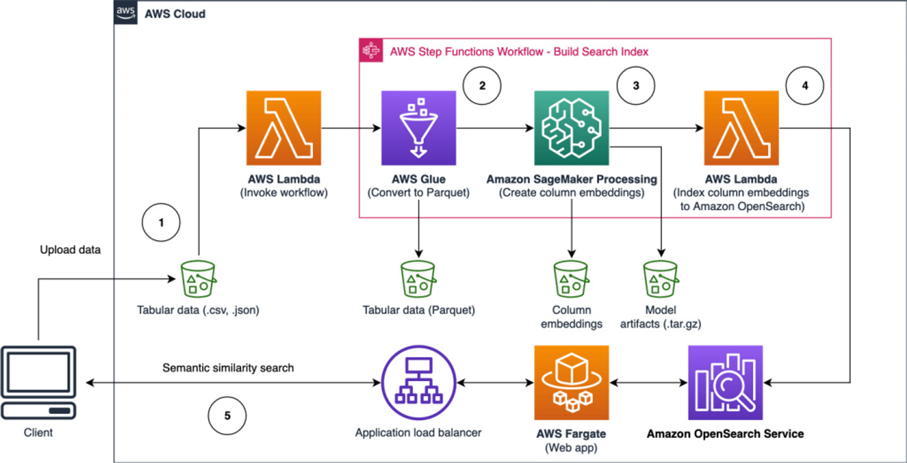

# Overview

## 시맨틱 검색이란

오픈서치의 시맨틱 검색은 검색 쿼리의 의미를 이해하고, 그에 따라 가장 관련성 높은 결과를 사용자에게 제공하는 기능입니다. 이는 전통적인 키워드 기반 검색과 달리, 검색 쿼리의 맥락과 의미를 분석하여 보다 정확하고 관련성 높은 검색 결과를 제공합니다. 예를 들어 "아마존"이라는 단어가 상품명인지, 회사명인지, 아니면 지역명인지 등 쿼리의 의미를 파악하여 그에 맞는 검색 결과를 제공합니다.

## 워크샵 아키텍쳐 (TBD)



# 시맨틱 검색 구현

## 사전 준비

데이터를 준비하는 과정과 Amazon OpenSearch Service에 연결하는 과정은 이전 과정인 lexical search와 동일합니다. 

## 모델 아이디 확인

[모델 배포](./02.DeployingModel.md) 과정을 참고하여 배포된 모델의 ID를 확인하고 아래와 같이 변수에 초기화합니다. 

```python
model_id = <your embedding model ID>
```

## INGEST PIPELINE 생성

*ingest pipeline*은 문서가 인덱스로 가져올 때 적용되는 *processor*의 연속입니다. 파이프라인의 각 [processor](https://opensearch.org/docs/latest/ingest-pipelines/processors/index-processors/)는 데이터를 필터링, 변환 또는 풍부하게 하는 등의 특정 작업을 수행합니다.

뉴럴 검색과 함께 사용될 때, 인제스트 파이프라인은 먼저 문서를 처리하여 검색 가능한 형태로 변환합니다. 이 변환 과정은 일반적으로 텍스트를 토큰화하고, 토큰을 벡터로 변환하는 과정을 포함합니다. 이 벡터는 이후 뉴럴 네트워크에서 사용됩니다.

뉴럴 검색은 이 벡터를 입력으로 받아, 쿼리와 가장 유사한 문서를 찾는데 사용합니다. 이 과정은 문서의 의미를 보다 정확하게 이해하고 추론할 수 있도록 돕습니다. 이렇게 처리된 문서들은 인덱스에 저장되고, 사용자의 검색 쿼리에 대한 응답으로 반환됩니다.

```python
pipeline = {
    "description": "An neural search pipeline for hotel index - OpenSearch-cohere-060124084807",
    "processors": [
        {
            "text_embedding": {
                "model_id": model_id,
                "field_map": {
                    "text": "vector_field",
                },
            }
        }
    ],
}

pipeline_id = "webtoon_embedding_pipeline"
aos_client.ingest.put_pipeline(id=pipeline_id, body=pipeline)
```

## 인덱스 생성하기

```python
index_name = "movie_semantic"

movie_semantic = {
    "settings": {
        "max_result_window": 15000,
        "analysis": {"analyzer": {"analysis-nori": {"type": "nori", "stopwords": "_korean_"}}},
        "index.knn": True,
        "default_pipeline": pipeline_id,
        "index.knn.space_type": "cosinesimil",
    },
    "mappings": {
        "properties": {
            "date": {
                "type": "float",
            },
            "genre": {
                "type": "text",
            },
            "img_url": {
                "type": "text",
                "fields": {"keyword": {"type": "keyword", "ignore_above": 256}},
            },
            "main_act": {
                "type": "text",
                "fields": {"keyword": {"type": "keyword", "ignore_above": 256}},
            },
            "page_url": {
                "type": "text",
                "fields": {"keyword": {"type": "keyword", "ignore_above": 256}},
            },
            "text": {
                "type": "text",
            },
            "rating": {"type": "float"},
            "supp_act": {
                "type": "text",
                "fields": {"keyword": {"type": "keyword", "ignore_above": 256}},
            },
            "title": {
                "type": "text",
                "fields": {"keyword": {"type": "keyword", "ignore_above": 256}},
            },
            "vote_count": {"type": "long"},
            "year": {"type": "long"},
            "vector_field": {
                "type": "knn_vector",
                "dimension": 1024,
                "method": {"name": "hnsw", "space_type": "l2", "engine": "faiss"},
                "store": True,
            },
        }
    },
}

aos_client.indices.create(index=index_name, body=movie_semantic)
```

## 데이터 저장하기

```python
from tqdm import tqdm
from opensearchpy import helpers

json_data = df.to_json(orient="records", lines=True)
docs = json_data.split("\n")[:-1]  # To remove the last empty line

def _generate_data():
    for doc in docs:
        yield {"_index": index_name, "_source": doc}

succeeded = []
failed = []
for success, item in helpers.parallel_bulk(
    aos_client, actions=_generate_data(), chunk_size=20, thread_count=2, queue_size=2
):
    if success:
        succeeded.append(item)
    else:
        failed.append(item)
```

# 검색 결과 비교

## 시맨틱 검색 실행

다음 쿼리를 사용해 시맨틱 검색을 수행합니다. 

```python
def semantic_search(query_text):
    query = {
        "size": 10,
        "_source": {"excludes": ["vector_field"]},
        "query": {
            "neural": {"vector_field": {"query_text": query_text, "model_id": model_id, "k": 30}},
        },
    }

    res = aos_client.search(index=index_name, body=query)

    query_result = []
    for hit in res["hits"]["hits"]:
        row = [
            hit["_id"],
            hit["_score"],
            hit["_source"]["title"],
            hit["_source"]["text"],
            hit["_source"]["genre"],
            hit["_source"]["rating"],
        ]
        query_result.append(row)

    query_result_df = pd.DataFrame(
        data=query_result, columns=["_id", "_score", "title", "plot", "genre", "rating"]
    )
    display(query_result_df)
```

그리고 키워드 검색을 실행하여 결과를 비교해봅니다.

```python
def keyword_search(query_text):
    query = {
        "size": 10,
        "query": {
            "multi_match": {
                "query": query_text,
                "fields": ["text"],
            }
        },
    }

    res = aos_client.search(index=index_name, body=query)

    query_result = []
    for hit in res["hits"]["hits"]:
        row = [
            hit["_id"],
            hit["_score"],
            hit["_source"]["title"],
            hit["_source"]["text"],
            hit["_source"]["genre"],
            hit["_source"]["rating"],
        ]
        query_result.append(row)

    query_result_df = pd.DataFrame(
        data=query_result, columns=["_id", "_score", "title", "plot", "genre", "rating"]
    )
    display(query_result_df)
```

### 축하합니다. 시맨틱 검색에 성공하셨습니다.